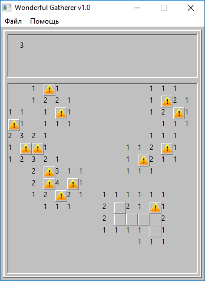

# Wonderful Gatherer
Implementation of minesweeper game in Python (wxPython).
Planning to add more features, but save win95 oldschool design style.

Ideas for development:
- Leave classic Minesweeper as a game option.
- Make such a game:
- 1) A player can open cells one by one.
- 2) Cell options are:
- 2.1) "+1"
- 2.2) "-2"
- 2.3) "!" - shows a random picture with a particular thing (tree, rock, fire, etc.)
- 2.4) "?" - If you guess the previous pic from "0" (from 3 options), you earn +10.
- To make a zero sum game, the probabilities should be:
- {"+1": 10, "-2": 10, "!": 1, "?": 1}
- => {"+1": 10/22, "-2": 10/22, "!": 1/22, "?": 1/22}

